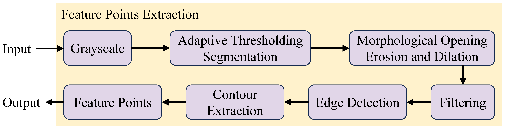

# Cell Division Event Recognition Based on Feature Point Prompts and Text Prompts

## Segmentation Based on Feature Point Prompts and Text Prompts

Feature points extraction

### Demo

**smofeature.ipynb**: Demonstration of SMO prediction on CTC data demo based on feature points prompts and text prompts

## Cell Division Event Recognition using SMO + CFT

Hybrid Tracking: feature points extraction + CFT

### Demo

**tracker.py**: Demonstration of cell division event recognition. Please unzip /results/results.zip first.