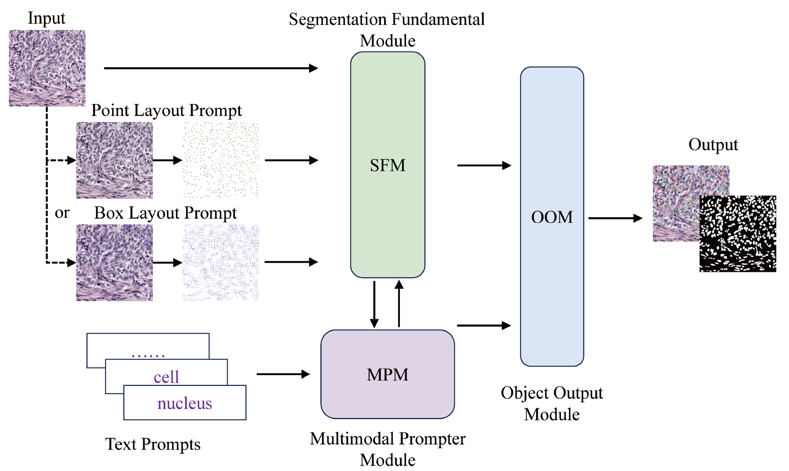

# Nucleus Segmentation Based on Layout Prompts and Text Prompts

We integrate cellular layout prompts along with text prompts into the SMO network to improve the network performance during the inference stage of nucleus segmentation tasks.

## Demo

**smoformonusegdemo.ipynb**: Demonstration of SMO prediction on MoNuSeg test data demo.
