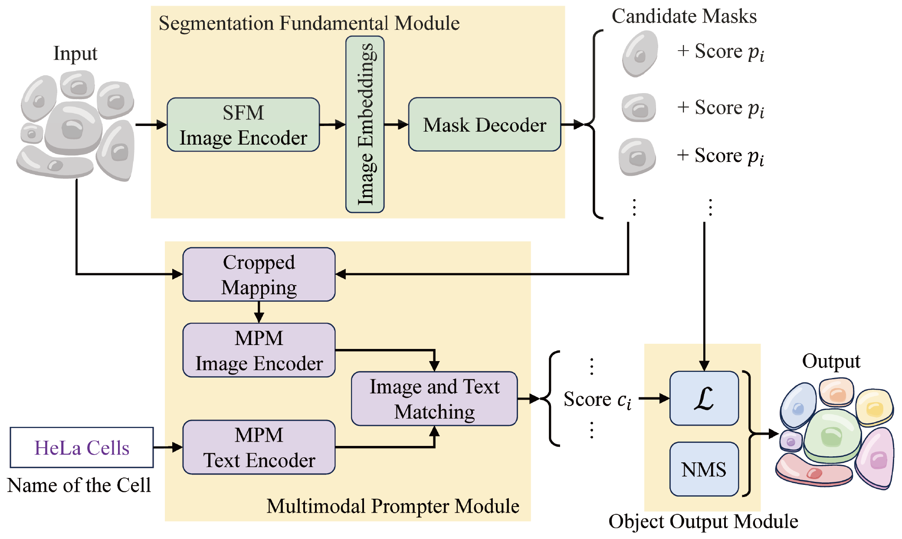

# Cell Segmentation Based on Text Prompts

We employed a multimodal prompter to associate the visual and linguistic modalities, thereby facilitating reciprocal comprehension of images and text. 

## Demo

**smo.ipynb**: Demonstration of SMO prediction on CTC data demo.
